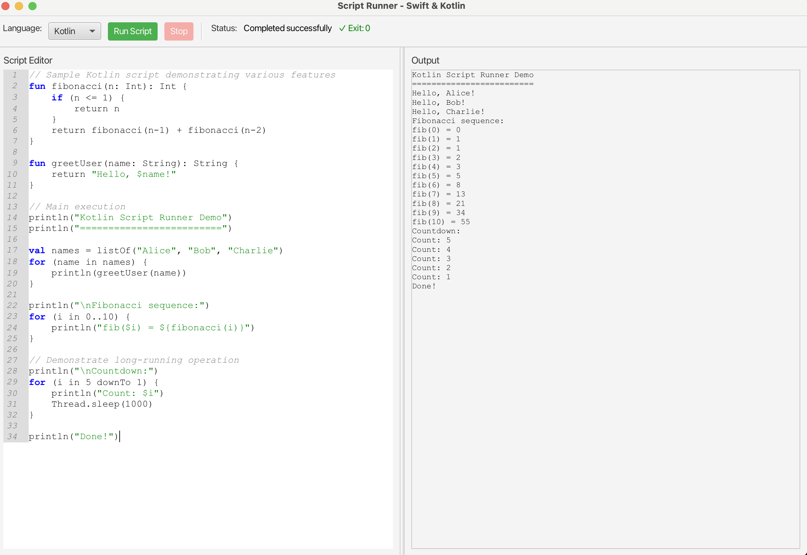

# Script Runner - GUI Tool for Swift & Kotlin Scripts

A JavaFX-based GUI application that allows users to write and execute Swift and Kotlin scripts with live output display, syntax highlighting, and error navigation.

## Features

### Core Functionality
- **Dual-pane interface**: Code editor on the left, live output on the right
- **Multi-language support**: Execute Swift (.swift) and Kotlin (.kts) scripts
- **Live output streaming**: See script output in real-time as it executes
- **Process management**: Start, stop, and monitor script execution
- **Exit code indication**: Visual feedback for successful (✓) and failed (✗) executions
- **Execution status**: Clear indication of when scripts are running

### Advanced Features
- **Syntax highlighting**: Keywords, strings, and comments highlighted in different colors
  - Swift keywords: `func`, `var`, `let`, `if`, `else`, `for`, `while`, `class`, `struct`, `import`
  - Kotlin keywords: `fun`, `var`, `val`, `if`, `else`, `for`, `while`, `class`, `object`, `import`
- **Clickable error navigation**: Single-click on blue underlined error locations to jump to the exact line and column in the code
- **Line numbers**: Built-in line numbering in the code editor
- **Responsive UI**: Resizable split pane and proper window management

## Prerequisites

### System Requirements
- **Java 17 or higher**: The application is built with Java 17
- **Maven**: Required for building and running the application
  - Install: `brew install maven` (macOS) or download from [maven.apache.org](https://maven.apache.org/install.html)
- **JavaFX 19**: Included as a Maven dependency
- **Swift**: For executing Swift scripts (macOS: built-in, Linux: install Swift)
- **Kotlin**: For executing Kotlin scripts
  - Install Kotlin compiler: `brew install kotlin` (macOS) or download from [kotlinlang.org](https://kotlinlang.org/docs/command-line.html)


## Installation & Build

### 1. Clone or extract the project
```bash
cd /path/to/script-runner
```

### 2. Build the application
```bash
mvn clean compile
```

### 3. Run the application
```bash
mvn javafx:run
```

Alternatively, you can package and run:
```bash
mvn clean package
java --module-path /path/to/javafx/lib --add-modules javafx.controls,javafx.fxml -cp target/script-runner-1.0.0.jar com.scriptrunner.ScriptRunnerApp
```

## Usage

### Basic Operation
1. **Select Language**: Choose Swift or Kotlin from the dropdown
2. **Write Code**: Enter your script in the left editor pane
3. **Run Script**: Click "Run Script" to execute
4. **View Output**: Watch live output in the right pane
5. **Stop Execution**: Click "Stop" to terminate long-running scripts

### Example Scripts

#### Swift Example
```swift
func greetUser(name: String) -> String {
    return "Hello, \(name)!"
}

// Main execution
print("Swift Script Runner Demo")
print("=======================")

let names = ["Alice", "Bob", "Charlie"]
for name in names {
    print(greetUser(name: name))
}

print("\nFibonacci sequence:")
for i in 0...5 {
    print("fib(\(i)) = \(fibonacci(n: i))")
}

print("Done!")
```

#### Kotlin Example
```kotlin
fun greetUser(name: String): String {
    return "Hello, $name!"
}

val names = listOf("Alice", "Bob", "Charlie")
for (name in names) {
    println(greetUser(name))
}

// Long running example
for (i in 1..5) {
    println("Count: $i")
    Thread.sleep(1000)
}
```

### Error Navigation
When scripts have compilation or runtime errors:
1. Error messages appear in the output pane with **blue underlined** clickable locations
2. **Single-click** on any blue `filename:line:column` link
3. The editor will automatically jump to the exact error location
4. The problematic code will be highlighted and selected
5. Visual feedback: hand cursor appears over clickable error locations

### Syntax Highlighting
- **Keywords** appear in **blue bold** text
- **Strings** appear in **green** text
- **Comments** appear in **gray italic** text
- Highlighting updates automatically as you type

## Technical Details

### Architecture
- **Main Application**: `ScriptRunnerApp.java` - JavaFX UI, coordination, and error navigation
  - GUI layout with dual-pane interface (CodeArea + TextFlow)
  - TextFlow-based output with clickable error links
  - Integrated error navigation and cursor positioning
  - Syntax highlighting coordination
- **Script Execution**: `ScriptExecutor.java` - Process management and output streaming
  - Manages Swift/Kotlin script execution via ProcessBuilder
  - Real-time output capture and streaming
  - Process lifecycle management (start/stop/cleanup)
- **Syntax Highlighting**: `SyntaxHighlighter.java` - Real-time code highlighting
  - Language-specific keyword highlighting
  - CSS-based styling for keywords, strings, comments
  - Background thread processing for performance

### Dependencies
- **JavaFX 19**: UI framework with TextFlow for rich text output
- **RichTextFX**: Advanced code editing with syntax highlighting and line numbers
- **Java 17**: Runtime and compilation target

### Implementation Details
- **Error Navigation**: Uses JavaFX TextFlow with individual Text nodes for clickable error locations
- **Output Handling**: Dual approach with TextArea fallback and TextFlow for rich formatting
- **Click Handling**: Direct mouse event handlers on Text nodes (no string parsing required)
- **Visual Feedback**: CSS styling for blue underlined links, hand cursor, and color-coded error messages
- **Performance**: Background thread syntax highlighting to avoid UI blocking

### Script Execution Details
- Swift scripts executed via: `/usr/bin/env swift script.swift`
- Kotlin scripts executed via: `kotlinc -script script.kts`
- Output streams are displayed live
- Processes can be forcibly terminated if needed


## Development

### Building from Source
```bash
git clone <repository-url>
cd script-runner
mvn clean compile
mvn javafx:run
```


## Screenshots

### Main Interface

*Dual-pane interface with code editor (left) and live output (right)*

### Kotlin Working

*Kotlin script execution with syntax highlighting and live output*


### Swift Working

*Swift script execution with syntax highlighting and live output*


### Clickable Error Navigation

*Click on blue error locations to jump to code, with indication of exit code*


### Script Execution with Status "Running"

*Live output streaming with execution status "running" indicator*

